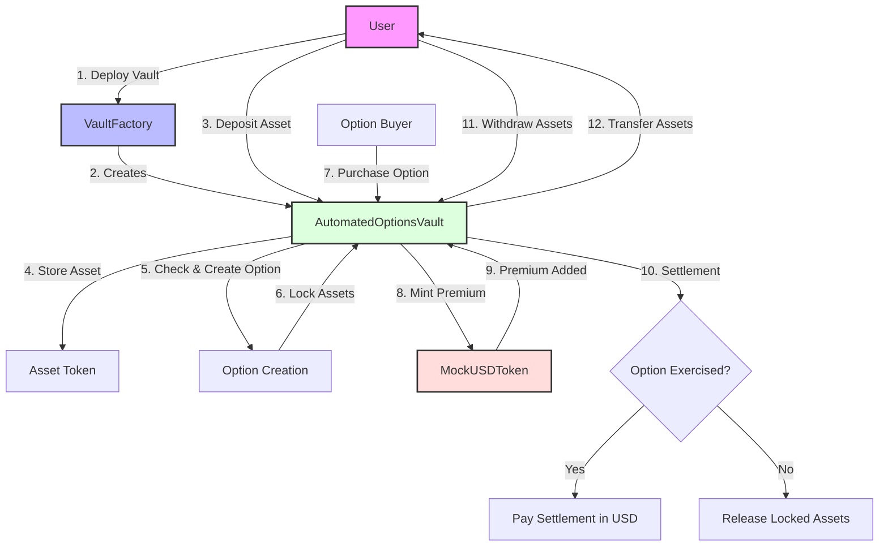

# Alliance-hackathon-contracts

## Flow

```mermaid
graph TD
    A[User] -->|1. Deploy Vault| B[VaultFactory]
    B -->|2. Creates| C[AutomatedOptionsVault]
    A -->|3. Deposit Asset| C
    C -->|4. Store Asset| D[Asset Token]
    C -->|5. Check & Create Option| E[Option Creation]
    E -->|6. Lock Assets| C
    F[Option Buyer] -->|7. Purchase Option| C
    C -->|8. Mint Premium| G[MockUSDToken]
    G -->|9. Premium Added| C
    C -->|10. Settlement| H{Option Exercised?}
    H -->|Yes| I[Pay Settlement in USD]
    H -->|No| J[Release Locked Assets]
    A -->|11. Withdraw Assets| C
    C -->|12. Transfer Assets| A

    style A fill:#f9f,stroke:#333,stroke-width:2px
    style B fill:#bbf,stroke:#333,stroke-width:2px
    style C fill:#dfd,stroke:#333,stroke-width:2px
    style G fill:#fdd,stroke:#333,stroke-width:2px
```
